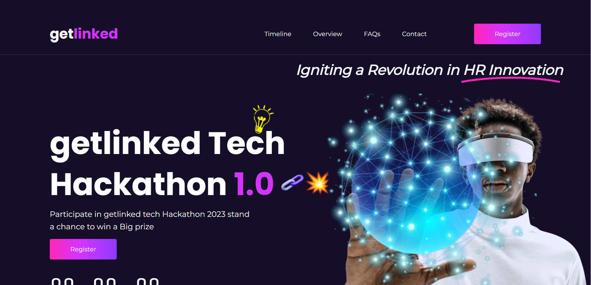
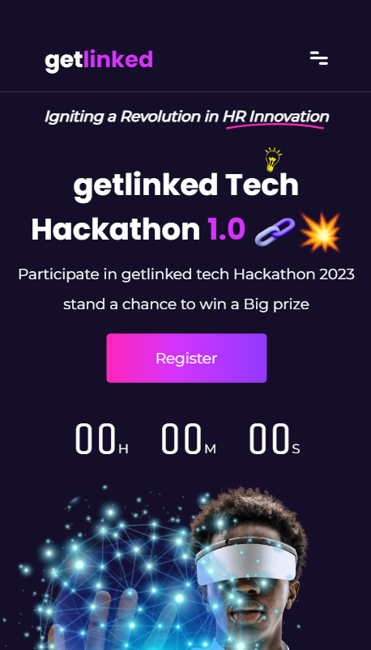
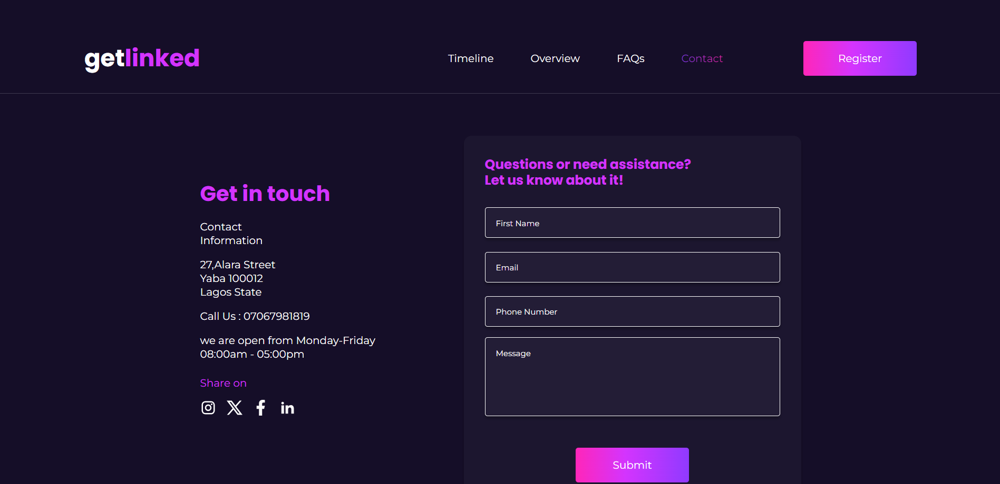
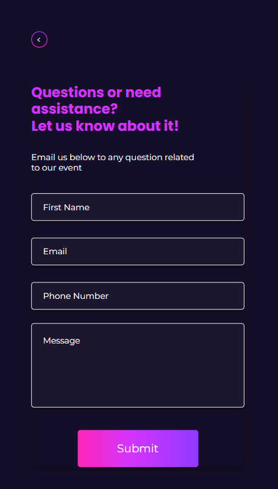
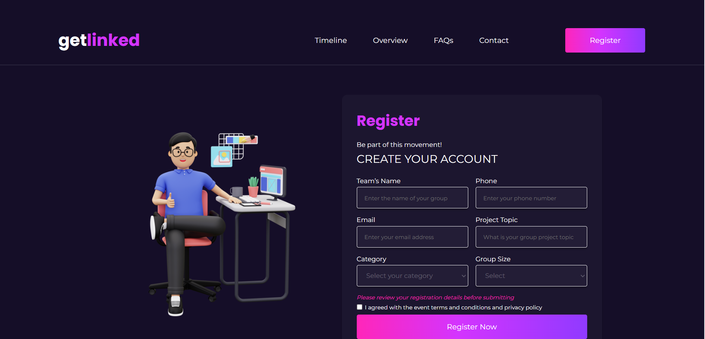
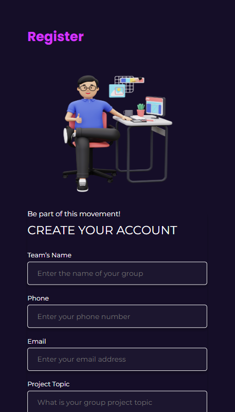

# A Get Linked Hackathon Challenge

This is a Hackathon challenge hosted by Get Linked company. The Challenge is focused on the ability to translate complex UI designs into visually appealing web pages.

## Overview

### The challenge

The tasked centered on translating a UI figma into interactive web pages, with API endpoints for both post and get requests.

## Built with

This project was built with Reactjs (TypeScript), A JavaScript Frontend Library. The styling was also completed with LESS module (a css preprocessor). The React project was setup with Vite as the build tool.

### Landing page:

## 

#### Mobile View

## 

### Contact Page:

#### Mobile View

### Registration Page

#### Mobile View

## Libraries used

- Axios
- React Router Dom

## Useful Links

- [GitHub](https://github.com/Doziechuks/get-link-hackathon)
- [Live link](https://get-link-hackathon.vercel.app/)
